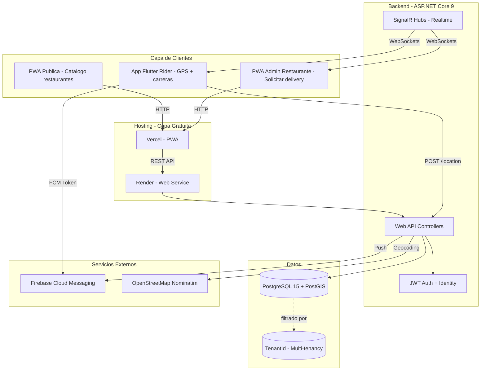

# Arquitectura y Patrones de Diseño - Puyo B2B2C Delivery

## 1. Visión General de la Arquitectura

Plataforma **B2B2C** de red de delivery. En la Fase 1 el foco es B2B: vendemos SaaS a empresas de delivery. En la Fase 2 se abre la red a restaurantes y clientes finales con checkout.



## 2. Stack Tecnologico

| Capa | Tecnologia | Justificacion |
|------|-----------|---------------|
| Backend | ASP.NET Core 9 Web API | Ecosistema .NET maduro, alto rendimiento, facil integracion con SignalR y EF Core |
| Real-time | SignalR | Nativo en .NET, gestiona conexiones WebSocket, reconexiones automaticas y grupos |
| ORM | Entity Framework Core | Migrations, LINQ, Global Query Filters para multi-tenancy |
| Base de datos | PostgreSQL 15 + PostGIS | PostGIS permite consultas espaciales para asignacion por cercania |
| Autenticacion | JWT + ASP.NET Core Identity | Roles y claims escalables |
| PWA | React o Vue + Vite + Tailwind CSS | Despliegue rapido en Vercel, acceso desde cualquier dispositivo |
| App rider | Flutter | APK directo, GPS en segundo plano, notificaciones push nativas |
| Push | Firebase Cloud Messaging | Gratis para el volumen de un MVP |
| Geocoding | OpenStreetMap Nominatim | Gratis, suficiente para Fase 1 |
| Backend hosting | Render free tier | Sin costo inicial, cold start tolerable en MVP |
| PWA hosting | Vercel free tier | Despliegue continuo desde Git |

## 3. Patrones de Diseno

### 3.1 Arquitectura en Capas (N-Layer / Clean Architecture simplificada)

```
PuyoDelivery.API          -> Controllers, SignalR Hubs, DTOs, middleware
PuyoDelivery.Core         -> Entidades, interfaces de repositorio, reglas de negocio puras
PuyoDelivery.Infrastructure -> EF Core, repositorios, servicios externos (FCM, OSM), JWT
```

**Por que:** separa la logica de negocio de la infraestructura. Facilita tests unitarios y cambiar PostgreSQL por SQL Server en el futuro sin tocar el core.

### 3.2 Repository + Unit of Work

Cada entidad principal tiene su repositorio (`IRiderRepository`, `IDeliveryRequestRepository`).
`IUnitOfWork` agrupa los repositorios y expone `SaveChangesAsync()`.

**Por que:** centraliza el acceso a datos y asegura transacciones atomicas (ej. crear orden + asignacion + notificacion).

### 3.3 Multi-tenancy con Global Query Filters (EF Core)

Todas las entidades de negocio heredan `BaseEntity` con `TenantId`.
En `OnModelCreating` se aplica:

```csharp
modelBuilder.Entity<Rider>().HasQueryFilter(r => r.TenantId == _currentTenant.Id);
```

`ICurrentTenantService` se resuelve desde el JWT en cada request.

**Por que:** una sola base de datos, datos aislados por empresa de delivery, bajo costo operativo en MVP.

### 3.4 JWT Auth con Claims por Rol

Roles:
- `SuperAdmin` (tu plataforma)
- `CompanyAdmin` (empresa de delivery)
- `RestaurantAdmin` (restaurante registrado)
- `Rider`

Cada token incluye `tenant_id`, `user_id`, `role`.

**Por que:** autorizacion declarativa con `[Authorize(Roles = "CompanyAdmin")]` y acceso al tenant actual sin consultas extras.

### 3.5 SignalR Groups para Real-time

- `company-{tenantId}` -> notificaciones a admins de una empresa.
- `rider-{riderId}` -> notificaciones push-like al rider.
- `restaurant-{restaurantId}` -> alertas de nuevo pedido asignado.

**Por que:** evita broadcast general, reduce trafico y garantiza privacidad entre tenants.

### 3.6 CQRS ligero (Commands + Queries)

No usamos MediatR completo de entrada, pero separamos operaciones de escritura y lectura:
- `Commands/` para mutaciones (crear request, asignar rider, actualizar ubicacion).
- `Queries/` para lecturas (listar riders online, restaurantes cercanos, historial).

**Por que:** prepara el terreno para escalar a MediatR + handlers si crece, sin complejidad inicial.

### 3.7 Result Pattern para respuestas de API

```csharp
public class Result<T>
{
    public bool IsSuccess { get; }
    public T Value { get; }
    public string Error { get; }
}
```

**Por que:** respuestas predecibles, manejo explicito de errores de dominio (rider ocupado, empresa suspendida, etc.).

### 3.8 Background Service para tareas programadas

`IHostedService` para:
- Limpiar riders offline despues de N minutos sin heartbeat.
- Recordatorios de suscripciones proximas a vencer.

**Por que:** usa infraestructura nativa de ASP.NET Core, sin dependencias externas en MVP.

## 4. Flujo de Datos Tipico (Fase 1)

1. **Restaurante** solicita delivery desde PWA Admin.
2. API crea `DeliveryRequest` con `TenantId`.
3. Admin de empresa de delivery ve el request en su dashboard.
4. Admin asigna manualmente un rider online y cercano (PostGIS).
5. API crea `OrderAssignment` y notifica al rider via SignalR + FCM.
6. Rider acepta/rechaza desde Flutter. Si acepta, envia GPS cada 5 segundos.
7. PWA Admin recibe actualizaciones de estado via SignalR.

## 5. Preparacion para Fase 2

El modelo de datos ya contempla:
- `Customer` (cliente final).
- `Order` con checkout.
- `CreditBalance` para el sistema de creditos del "Asistente de Promociones".
- `Promotion` para campanas futuras.

Asi la migracion a B2B2C no requiere rehacer la base de datos.

## 6. Consideraciones de Escalabilidad Futura

- **AWS:** RDS PostgreSQL, ECS/Fargate para API, ElastiCache para sesiones SignalR backplane.
- **Render paid:** elimina cold starts.
- **Play Store:** publicar APK formalmente en Fase 2.
- **MediatR + Event Sourcing:** si el flujo de pedidos se vuelve complejo.
